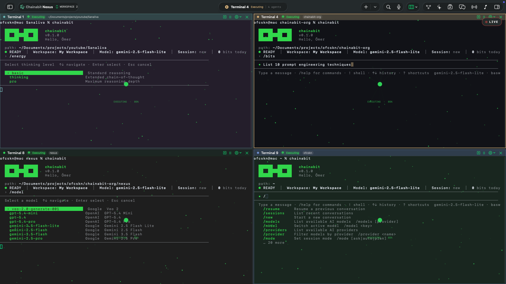

# Chainabit CLI



The official Chainabit terminal control plane for workspaces, AI workflows, and connectors.

[npm package](https://www.npmjs.com/package/chainabit) · [chainabit.com](https://chainabit.com)

Use the CLI to:

- sign in with the browser device-approval flow or developer tokens
- pin workspace context for repeated commands
- inspect chainies, chains, bits, and wallet state
- run AI sessions, suggestions, and Chao conversations
- install, authenticate, test, and execute connectors
- create, scope, and revoke developer tokens for CI/CD automation
- script repeatable automation with `--json`

## Install

Global install:

```bash
npm install -g chainabit
```

Project-local install:

```bash
npm install --save-dev chainabit
npm exec -- chainabit --help
```

Both `chainabit` and `cb` are installed as command aliases.

Requires Node.js **20 or newer**.

## Update

```bash
npm install -g chainabit@latest
chainabit --version
```

## Quick Start

### 1. Set up environment

The CLI never auto-loads `.env` files from the current directory. Pass the file explicitly or export the env var before running any command. See [`.env.example`](./.env.example) for the supported variables.

```bash
# Option A — pass on every command
chainabit --env-file ./.env.local auth login

# Option B — export once for the shell session
export CHAINABIT_ENV_FILE="$PWD/.env.local"
chainabit auth login
```

### 2. Log in

```bash
chainabit auth login
# Opens your browser to the device-approval page. Sign in and click Approve.
```

### 3. Set a workspace

```bash
chainabit workspace use ws_123
chainabit workspace current
```

### 4. Run commands

```bash
chainabit connectors list --category productivity
chainabit ai session create --title "Weekly review"
chainabit auth whoami
```

## CI/CD with Developer Tokens

Create a developer token once (shown once — copy it immediately):

```bash
chainabit auth keys create "github-actions" --ttl 90 --scope execution:run
# → API key created: cbt_live_xxxxxxxxxxxxxxxxxxxx
```

Use it in your pipeline:

```bash
export CHAINABIT_TOKEN=cbt_live_xxxx
export CHAINABIT_BASE_URL=https://api.chainabit.com/api/v1
chainabit workspace use ws_123
chainabit ai session list --json
```

Manage keys:

```bash
chainabit auth keys list
chainabit auth keys revoke <id>
```

## Command reference

Run `chainabit --help` for the full, always-current command list, or `chainabit <command> --help` for any subcommand. Full documentation lives at the [Chainabit Docs](https://github.com/chainabit/docs).

## Environment variables

| Variable | Description | Default |
|----------|-------------|---------|
| `CHAINABIT_BASE_URL` | API base URL | `https://api.chainabit.com/api/v1` |
| `CHAINABIT_APP_BASE_URL` | Frontend app origin — required for browser device-approval | — |
| `CHAINABIT_TOKEN` | Access token or developer token (`cbt_live_...`) — skips interactive login | — |
| `CHAINABIT_WORKSPACE_ID` | Default workspace ID for all commands | — |
| `CHAINABIT_ENV_FILE` | Path to an env file to load on startup | — |

## Reporting bugs & requesting features

- 🐛 [Report a bug](https://github.com/chainabit/cli/issues/new?template=bug_report.yml)
- 💡 [Request a feature](https://github.com/chainabit/cli/issues/new?template=feature_request.yml)
- 🔒 Security issues: see [SECURITY.md](./SECURITY.md) — please do **not** open public issues for vulnerabilities.

See [CONTRIBUTING.md](./CONTRIBUTING.md) for how to file an effective report.

## License

Proprietary. See [LICENSE](./LICENSE). The published binary is distributed for use; the source code is private and is **not** licensed for copying, modification, redistribution, or reverse engineering.
